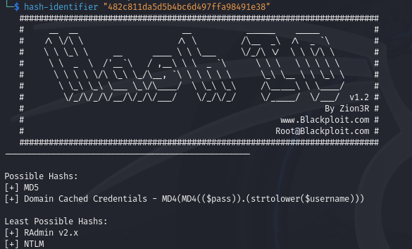
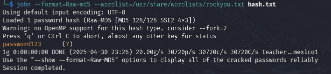

## hashcrack

### Description
A company stored a secret message on a server which got breached due to the admin using weakly hashed passwords. Can you gain access to the secret stored within the server?
Access the server using `nc verbal-sleep.picoctf.net 57192`

要約すると、弱いハッシュ関数を使ったパスワードが使われている。パスワードクラッキングする。

---

早速webシェルを起動して、`nc verbal-sleep.picoctf.net 57192`を実行する。  

```sh
$ nc verbal-sleep.picoctf.net 57192
Welcome!! Looking For the Secret?

We have identified a hash: 482c811da5d5b4bc6d497ffa98491e38
Enter the password for identified hash: 
```
まずは、このハッシュ値がどのハッシュ関数を使用して生成されたのか調べる。  
hash-identifier を使用して、調べる。  



MD5が最優先候補に上がった。
john the ripperでパスワードクラッキングしてみる。  



それっぽい平文が出てきたので、パスワードを入力してみる。

```sh
Enter the password for identified hash: password123
Correct! You've cracked the MD5 hash with no secret found!

Flag is yet to be revealed!! Crack this hash: b7a875fc1ea228b9061041b7cec4bd3c52ab3ce3
Enter the password for the identified hash: 
```

当たっていたようだ。続いて次のハッシュ値が出てきた。  
ここからの流れは、先ほどと同様なので、ダイジェストで行う。  
hash-identifier を使用して、ハッシュ関数を調べる。  
```sh
$ hash-identifier "b7a875fc1ea228b9061041b7cec4bd3c52ab3ce3"
```

今度は、SHA-1が最有力候補に上がったので、johnでクラッキングする。  
```sh
$ john --format=Raw-SHA1 --wordlist=/usr/share/wordlists/rockyou.txt hash2.txt
```

出てきた平文 letmein を入力する
```
Enter the password for the identified hash: letmein
Correct! You've cracked the SHA-1 hash with no secret found!

Almost there!! Crack this hash: 916e8c4f79b25028c9e467f1eb8eee6d6bbdff965f9928310ad30a8d88697745
Enter the password for the identified hash:
```

当たっていたようだ。続いて次のハッシュ値が出てきた。  
同様にして、

```sh
$ hash-identifier "916e8c4f79b25028c9e467f1eb8eee6d6bbdff965f9928310ad30a8d88697745"
```
今度は、SHA-256が最有力候補に上がったので、johnでクラッキングする。  

```sh
$ john --format=Raw-SHA1 --wordlist=/usr/share/wordlists/rockyou.txt hash2.txt
```

出てきた平文 qwerty098 を入力する
Flagがゲットできた。

```
Enter the password for the identified hash: qwerty098
Correct! You've cracked the SHA-256 hash with a secret found. 
The flag is: picoCTF{
```
※Flagは意図的に消してあります。