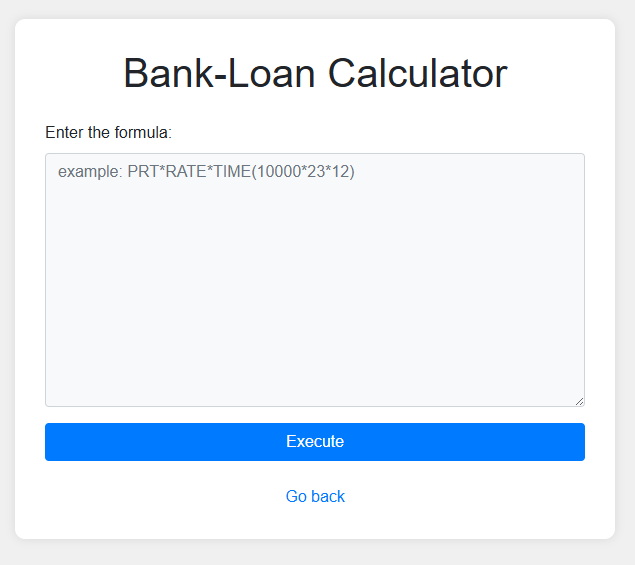

## SSTI2

### Description  

ABC Bank's website has a loan calculator to help its clients calculate the amount they pay if they take a loan from the bank. Unfortunately, they are using an eval function to calculate the loan. Bypassing this will give you Remote Code Execution (RCE). Can you exploit the bank's calculator and read the flag?
Additional details will be available after launching your challenge instance.

要約すると、
eval関数を使っている。これを使って、リモートコード実行(RCE)を行える。

---

早速、webサイトにアクセスする。  
下のようなwebサイトが開く。




欄に "Hello world"と入力する。Result: Hello world と表示された。  
ページのソースを開くと、以下のような制約があるようだ。
```
    Secure python_flask eval execution by 
        1.blocking malcious keyword like os,eval,exec,bind,connect,python,socket,ls,cat,shell,bind
        2.Implementing regex: r'0x[0-9A-Fa-f]+|\\u[0-9A-Fa-f]{4}|%[0-9A-Fa-f]{2}|\.[A-Za-z0-9]{1,3}\b|[\\\/]|\.\.'
```

### 一旦、状況整理をする
- Server: Werkzeug/3.0.6 Python/3.8.10
- ヒント2：The flag file is `/flag.txt`
- ブラックリスト型の防御(osやls)
- 正規表現による16進数やURLエンコードの使用不可、\や/の使用不可

### 状況から考察する
- pythonのeval関数を使用しているので、eval関数の脆弱性を利用
- flag.txtに書かれている内容を読み込みたい。
    - pythonのopenあたりが使えそう
- ブラックリストで検索されているから直でosなどの文字を書くことはできない。
    - 8進数エスケープなどの難読化を行う必要がある。

```
open('flag.txt').read()
```

openやreadなどの単語が使えたので、flag.txtの部分のみをbase64で難読化して実行してみる
```
open(__import__('base64').b64decode('L2ZsYWcudHh0').decode()).read()
```


Flagがゲットできた