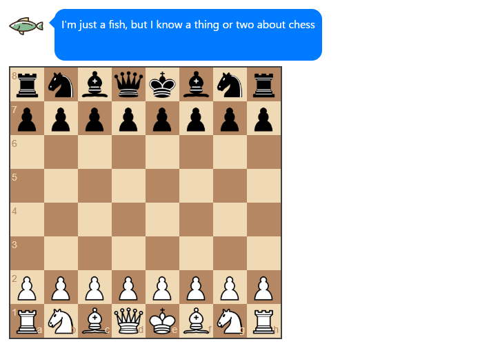
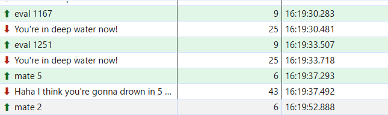

## WebSockFish

### Description 

Can you win in a convincing manner against this chess bot? He won't go easy on you!

要約すると、このチェスボットに勝てますか？
チェスボットに勝つ = Flagにたどり着く ということ？

---
サイトを開いてみる  
下のようなサイトが開く

適当に駒を動かすと普通にチェスができる。  
ネットワークタブに `ws/`という名前のファイルがあった。  
どの駒を動かしたかによって、評価をクライアント側で行って、サーバー側に送っているようだ。

この評価点によって、魚のコメントが変わっている。  
これをBurpSuiteで操作すれば、Flagがゲットできるかもしれない。  
評価点は、負の数から正の数まである。  
負の数にすると、こちらが優勢のようなコメントを魚がしてきた。  
値を -100,000 にしたらFlagがゲットできた。
