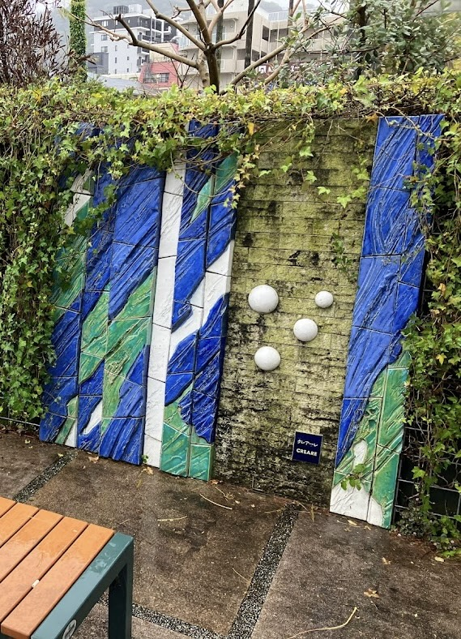

2014年6月6日
https://hashikazu.org/archives/12598

## Casca
### 問題文
海が綺麗なこの日本の街は、かつてポルトガルのリゾート地との交流がありました。
この写真のすぐ右側にはその記念碑が置かれています。記念碑に書かれている「式典の開催日」を答えてください。
Format: TsukuCTF25{YYYY/MM/DD}

---

問題の写真

google画像検索をする
[こちらのサイトでそれらしき物を発見](https://gourmet-travelogue.doorblog.jp/archives/56226093.html)

この記念碑は、熱海市とポルトガルのリゾート地カスカイス市の友好のシンボル  

googleで、「熱海市とカスカイス市 式典」で調べると、  
[こちらのサイト](https://hashikazu.org/archives/12598)に行きついた。

サイトから平成26年6月6日ということがわかったので、Flagを作成する。  
`TsukuCTF25{2014/06/06}`
正解した