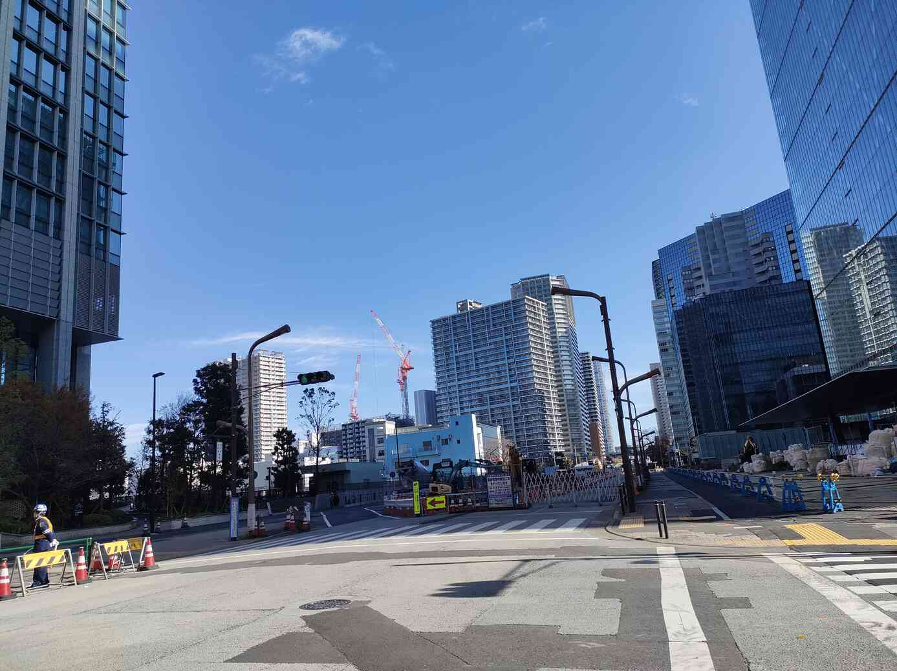
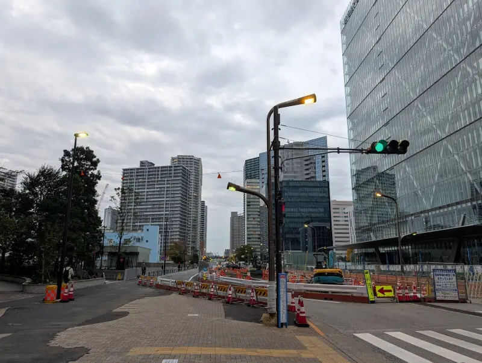

## buildings

### 問題文
あの建物が建ったら、また空が狭くなるんだろうな。
フラグフォーマットはこの人が立っている場所のTsukuCTF25{緯度_経度}です。ただし、緯度および経度は小数点以下五桁目を切り捨てたものとします。

---

問題の写真

この写真がどこで撮影されたかを探す。  
googleで画像検索する。  
下のURLのおまけに似たような写真を見つけた。
https://view.tokyo/?p=67714

実際の写真  

記事の文章に`港南側と高輪側をつなぐ、環状四号線の工事の様子です`とあった。  
google mapでこの場所を調べてみる。  
`〒108-0075 東京都港区港南１丁目２`この場所が写真と一致した。  

こちらのサイトで 住所から緯度経度が出せる。（少し微調整が必要）
https://www.geocoding.jp/

先ほどの住所を入力して、緯度35.631864, 経度139.743094が分かったので、flagを作成する。
正解した。  
`TsukuCTF25{35.6318_139.7430}`