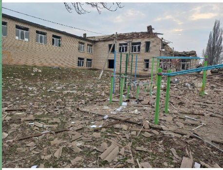

## destroyed
### 問題文
この[Telegram](https://t.me/etozp/19319)の投稿の写真に写っている学校を特定してください。  
フラグフォーマットはその場所の座標の小数点第4位を四捨五入して、小数第3位までをTsukuCTF25{緯度_経度}の形式で記載してください。  
例: TsukuCTF25{12.345_123.456}   
注意: この問題を解く過程で、戦争に関わる直接的な画像が表示される場合があります  

---

問題の写真  


ウクライナ関連のニュースで見たことあるなと思いつつ画像検索。  
同じ画像は見つかるが、住所がわからない  

Telegramの本文を読んでみると、  
```
Наслідки потрапляння ракет у гімназію Степненської громади. 
↓ google翻訳
ステプノコミュニティ体育館にミサイルが命中した結果。
```

どうやら、ステプノコミュニティ体育館というところらしい。  
google mapで検索。 → 出てこない。  
英語でも検索 `Stepne community gymnasium, Ukraine` → 出てこない。  
community gymnasiumが悪さをしてそうなので、  
`Stepne, Ukraine` -> [それっぽい地域が出た](https://www.google.com/maps/place/Stepne,+%E3%82%B6%E3%83%9D%E3%83%AA%E3%83%BC%E3%82%B8%E3%83%A3+%E3%82%A6%E3%82%AF%E3%83%A9%E3%82%A4%E3%83%8A+70432/@47.7973146,35.3037427,16z/data=!3m1!4b1!4m6!3m5!1s0x40dc5beca59ce337:0x67c8a888631fcee!8m2!3d47.797249!4d35.3072124!16s%2Fg%2F121876cx?entry=ttu&g_ep=EgoyMDI1MDQzMC4xIKXMDSoASAFQAw%3D%3D)  

ストリートビューが20~30ほどしか無いので、総当たりで探す。

[この場所が怪しい](https://www.google.com/maps/place/Stepne,+%E3%82%B6%E3%83%9D%E3%83%AA%E3%83%BC%E3%82%B8%E3%83%A3+%E3%82%A6%E3%82%AF%E3%83%A9%E3%82%A4%E3%83%8A+70432/@47.797058,35.304544,3a,75y,280.36h,84t/data=!3m8!1e1!3m6!1sCIHM0ogKEICAgICEzfrdLA!2e10!3e11!6shttps:%2F%2Flh3.googleusercontent.com%2Fgpms-cs-s%2FAB8u6Ha8iL69ei0un5pW7YBWFAPiPptuwuZM_jupOTLQWNQ6dC44PLuqkAC41RWRMnjhuI769n0Y7QGIs_3eLDoQhyc_BlBvSB0eADaukO6WwZVCy8Hb-kNYLmT0pTPYoL5VVz40A1tk%3Dw900-h600-k-no-pi6-ya280.36-ro0-fo100!7i5472!8i2736!4m7!3m6!1s0x40dc5beca59ce337:0x67c8a888631fcee!8m2!3d47.797249!4d35.3072124!10e5!16s%2Fg%2F121876cx?entry=ttu&g_ep=EgoyMDI1MDQzMC4xIKXMDSoASAFQAw%3D%3D)  


google mapでピンを立てたら、緯度47.797189, 経度35.305241が得られた  
問題文のとおりにFlagを作成。  
`TsukuCTF25{47.797_35.305}`  
正解した。  