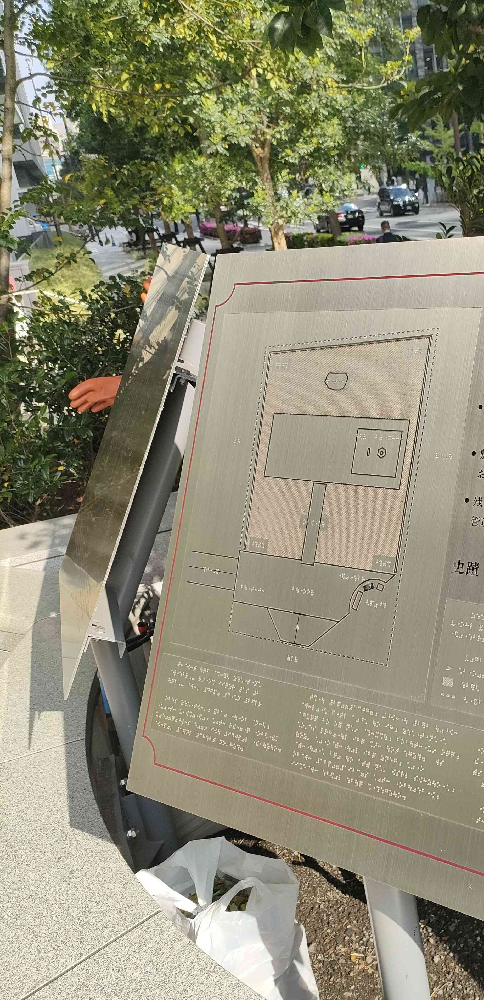

## power
### 問題文
力を感じてきた。

フラグフォーマットはこの人が立っている場所のTsukuCTF25{緯度_経度}です。ただし、緯度および経度は小数点以下五桁目を切り捨てたものとします。

---

問題の写真

なにやら点字が書かれている。  
google画像検索をしても良い結果は得られなかった。  
https://ksnk.jp/brl2chr.html  

こちらのサイトで、点字を解読すると、`平将門`に関連した何かということが分かった。  
また、地図の点字を解読すると、`石碑`と`石灯篭`という単語が出てきた。  
googleでこれらの単語を入れて検索。  
https://ameblo.jp/sirobara-1166/entry-12673411299.html  

こちらのサイトから`千代田区大手町：将門塚`ということが判明。  
google mapで住所を調べて、[住所から緯度経度を調べて](https://www.geocoding.jp/)  
微調整をして、緯度35.687247, 経度139.762753 が分かったので、Flagを作成。  
`TsukuCTF25{35.6872_139.7627}`  
正解した。
