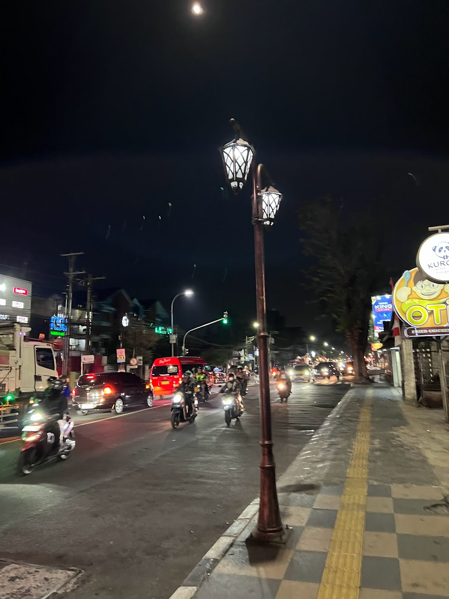

## rider
### 問題文
遠くまで歩き、夕闇に消える足跡  
煌めく街頭が、夜の街を飾る  
傍らの道には、バイクの群れが過ぎ去り  
風の音だけが残る  

光と影の中、ふと立ち止まり思う  
私は今、どこにいるんだろう  
フラグフォーマットはこの人が立っている場所のTsukuCTF25{緯度_経度}です。ただし、緯度および経度は小数点以下五桁目を切り捨てたものとします。  

ヒントを見る
この詩に意味はありません。

----
問題の写真  

まず、詩には意味が無いので無視する。  
google画像検索をする。  
インドネシアの写真がいっぱい出てくるがどこなのかさっぱりわからない。  

画像を拡大したり、して検索をする。

こちらの看板の写真とインドネシアという単語を一緒にgoogle画像検索する。  
店のインスタが見つかった。  
https://www.instagram.com/otichicken.id/

ここから`OTI Fried Chicken`というチェーン店だと判明。  
インドネシアに15店舗ほどあるので、総当たりで、写真の画角にあう場所を探した。  
`MFJW+9R サラティーガ, インドネシア 中部ジャワ サラティーガ Sidorejo`
こちらの住所の店がそれっぽかったので、撮られた場所を探して、  
[住所から緯度経度](https://www.geocoding.jp/#google_vignette)を求めて、  
緯度-7.318921, 経度110.497070 と分かった。  
問題文の通りにFlagを作成して  
`TsukuCTF25{-7.3189_110.4970}`  
正解した。