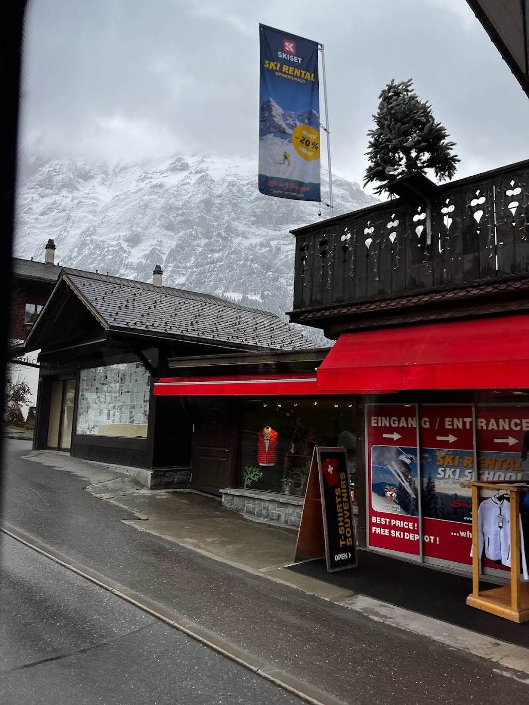

## schnee
### 問題文
素敵な雪山に辿り着いた！スノーボードをレンタルをして、いざ滑走！
フラグフォーマットは写真の場所の座標の小数点第4位を四捨五入して、小数第3位までをTsukuCTF25{緯度_経度}の形式で記載してください。
例: TsukuCTF25{12.345_123.456}

---

問題の写真

とりあえず、googleで画像検索。  
それっぽい写真は出てくるが、場所がわかる情報がない。  

何回か写真を拡大したりして、  

このような画像をゲットできた。

店の名前を拡大したり、明るさなどを変えて、何度かgoogleで画像検索をした。  

すると、このサイトに行きついた。  
https://www.tripadvisor.ch/LocationPhotoDirectLink-g188080-d2042212-i234233773-Buri_Sport-Grindelwald_Jungfrau_Region_Bernese_Oberland_Canton_of_Bern.html  

このサイトより、 `グリンデルワルデのBuri Sportのスポーツ用品店`ということが分かった。  

Buri Sportをgoogle mapで調べて、ストリートビューで、総当たりで、写真の画角にあう場所を探した。  

すると、`Dorfstrasse 160, 3818 Grindelwald, スイス`の店が見た目で一致。
[住所から緯度経度を求められるサイト](https://www.geocoding.jp/)で  
緯度: 46.623446 経度: 8.039966 と分かった

問題の指定の通りにFlagを作る。
`TsukuCTF25{46.623_8.040}`
正解した。