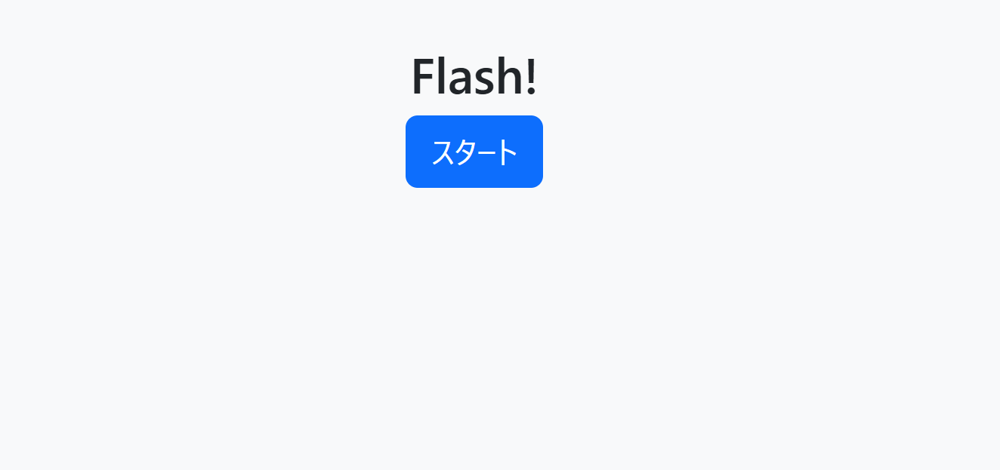

https://www.kirsle.net/wizards/flask-session.cgi

## flash
### 問題文
medium
3, 2, 1, pop!

http://challs.tsukuctf.org:50000/

---

早速、urlにアクセスする。  

スタートボタンを押すと、高速で、数字が表示される。  
途中で表示されなくなる。  
ソースコードが配布されているので、覗いてみると、シード値とセッションIDで表示する数字を決めている。

セッションIDは毎回変わるが、
シード値はseed.txtを参照している。  

seed.txtを取得する。  
`wget http://challs.tsukuctf.org:50000/static/seed.txt`

セッションIDは、毎回変わるが、クッキーに保存されているので、

公開サイトの方を動かす。  
セッションIDを取得する  
セッションIDを固定で、ローカルを動かす。  
合計値を得る  
公開サイトに合計値を入力する。  

という流れでいける。

`TsukuCTF25{Tr4d1on4l_P4th_Trav3rs4l}`  
Flagがゲットできた。
